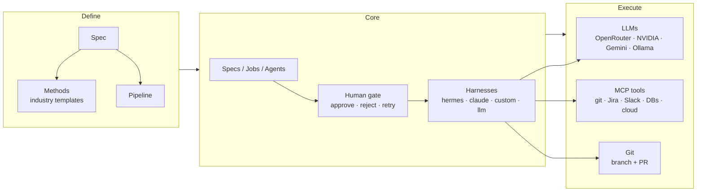

# SpecFlow

**Spec-driven development orchestration.** Define features as specs, run them through method-driven pipelines (industry templates or custom actions), let an agent implement against your git repo via pluggable harnesses and LLM providers, and connect your tools over MCP.

## How it works



<details>
<summary>ASCII version</summary>

```
  Spec ──▶ Method ──▶ Pipeline                    (define)
                  │
                  ▼
      Specs / Jobs / Agents ──▶ Human gate ──▶ Harness
                                        │   hermes · claude · custom · llm
                                        │
                   ┌────────────────────┼────────────────────┐
                   ▼                    ▼                    ▼
                 LLMs               MCP tools              Git
        OpenRouter · NVIDIA    git · Jira · Slack   branch + PR (no merge)
        Gemini · Ollama        · DBs · cloud
```

</details>

## Features

- **Spec-driven workflow** — features go through `backlog → in_progress → review → done`.
- **Pipelines are first-class** — a spec selects a reusable pipeline (its step chain); build/edit them in a dedicated **Pipelines** screen, and a spec editor just picks one.
- **Method-driven steps** — every step (and verify sub-agent) picks a **method**: an **industry template** (ordered simplest → most complex across `plan`/`code`/`test`/`review`/`docs`) **or a custom action** (a script in `<repoRoot>/.specflow/actions/<phase>/`). Steps can also be fully custom.
- **Authentic methodology sources** — every built-in template inlines its real, canonical prompt (not an approximation): GitHub **Spec Kit** (`/specify /plan /tasks /implement /checklist`), **MADR ADR**, **TDD**, **Conventional Commits v1.0.0**, **Keep a Changelog**, Martin Fowler's **Test Pyramid**, **OWASP Threat Modeling (STRIDE)**. Sources live under [`templates/<methodology>/`](templates/); edit them and every pipeline using that method picks it up.
- **Prompts are materialized & stored** — the effective prompt for every step is written onto the step on save + startup: always visible, editable and versioned — never an invisible run-time side effect.
- **Disk store for pipelines** — each pipeline persists as a git-versionable folder (`pipeline.json` struct + `prompts/<step>.md`). See [`src/core/pipelinestore.js`](src/core/pipelinestore.js).
- **Verify-and-iterate** — a step can define verify sub-agents; on failure the step re-runs with feedback up to its iteration budget.
- **Human gates** — the pipeline pauses after each step for your **Approve / Reject / Retry**.
- **Agent session chat** — messages persist and are injected into prompts as live guidance.
- **Pluggable harnesses** — `hermes`, `claude`, `custom`, `llm` per step.
- **Pluggable LLM providers** — OpenRouter, NVIDIA NIM, Google Gemini, Ollama, LiteLLM.
- **Git integration** — auto branch-per-spec, commit, **open a PR (never auto-merges)**.
- **MCP tool connections** — connect MCP servers (git, Jira, Slack, filesystem, …); every node can use every configured MCP. Includes **33 one-click presets**.
- **Encrypted secrets vault** — store API keys/tokens encrypted at rest (AES-256-GCM) and reference them from MCP/agent config.
- **Web UI** — feature board, spec detail (steps + chat + runs), pipelines builder, agents, config; live job logs (Socket.IO); mobile-friendly step editor.

---

## Quickstart

1. **Install & run**

   ```bash
   npm install
   cp .env.example .env     # add API keys + repo config
   npm run setup            # creates data/ and work/
   npm start                # → http://localhost:9120/ui/
   ```

   On first start SpecFlow seeds 6 industry pipelines (GitHub Spec Kit Full Flow, TDD, Security-First OWASP, Performance-Aware, Docs + Release, MVP Quick Start) plus a default, and materializes prompts for every step.

2. **Create & run a spec (UI)**
   1. **New Spec** — title, description, acceptance criteria, repo (or a connection), pipeline.
   2. **Run** — uses the pipeline's methods (no model/harness re-ask).
   3. The pipeline runs step-by-step, **pausing** after each step for your **Approve / Reject / Retry**.
   4. Steps that commit open a **PR** for you to review and merge.

3. **CLI**

   ```bash
   node src/cli.js spec create --title "Add health endpoint" --repo git@github.com:owner/repo.git
   node src/cli.js spec run <SPEC_ID>
   node src/cli.js job logs <JOB_ID>
   ```

---

## Claude-Code-only setup (simplest)

If you already use **Claude Code**, that's all you need — no OpenRouter/Gemini/NVIDIA keys. Claude brings its own auth.

```bash
# Prereqs: node + claude (Claude Code CLI) installed
bash scripts/setup-claude.sh myorg/myapp
npm start                 # → http://localhost:9120/ui/
```

The script installs deps, writes a Claude-only `.env`, sets the default harness to `claude`, and seeds the **"Claude Code (all steps)"** pipeline (specify → plan → implement → test → review, all via Claude Code).

Then in the UI: **New Spec** → repo → pipeline **"Claude Code (all steps)"** → **Run**.

> Any pipeline can be Claude-first too: set a step's **Harness** to `claude` (it overrides the method's default), or change the default in **Config → Preferences → Default harness**.

---

## Connecting tools (MCP)

MCP (Model Context Protocol) lets pipeline agents call real tools. Add a server under **Config → MCP Connections**; every configured MCP is exposed to every node.

- **Presets** — pick a template (GitHub, Jira, Slack, Playwright, PostgreSQL, …), paste any API key, done. `GET /api/mcp/presets`.
- **Transports** — `stdio` (local command) or `sse`/streamable HTTP (remote URL).
- **Test** — each connection is verified (handshake + `tools/list`) and its tools shown.
- **Tool injection** — enabled MCP tools are listed in every step prompt so any node (plan, code, test, review) can call them.

Example (stdio, filesystem server):

```bash
# name: fs | transport: stdio
# command: npx | args: -y @modelcontextprotocol/server-filesystem /path
```

## Secrets vault

Store sensitive values encrypted at rest and reference them anywhere an env value is expected.

```bash
# 1. add a secret (AES-256-GCM)
POST /api/secrets  {"key":"github_pat","value":"ghp_...","note":"deploy token"}

# 2. reference it in an MCP connection's env or agent config
{ "env": { "GITHUB_PERSONAL_ACCESS_TOKEN": "${secret:github_pat}" } }
```

- Master key: `SPECFLOW_SECRETS_KEY` (32-byte hex) or auto-generated `.specflow/secrets.key` (`chmod 600`).
- `/api/secrets` **never returns** a stored value in list/detail responses.

---

## Configuration

### Environment variables

See `config.example.yaml` and `.env.example`.

| Variable | Meaning |
|----------|---------|
| `SPECFLOW_PORT` | HTTP port (default `9120`) |
| `SPECFLOW_DB` | SQLite path (default `data/specflow.db`) |
| `SPECFLOW_REPO_ROOT` | where repos are cloned (default `./work`) |
| `SPECFLOW_SECRETS_KEY` | 32-byte hex master key for the secrets vault |
| `OPENROUTER_API_KEY` | for `provider: openrouter` |
| `NVIDIA_API_KEY` | for `provider: nvidia` |
| `GOOGLE_API_KEY` | for `provider: gemini` |
| `GITHUB_TOKEN` | token for auto-creating PRs |
| `SPECFLOW_WHATSAPP_WEBHOOK_URL` | optional outbound WhatsApp/webhook relay |

### Editable preferences (Config → Preferences)

Default harness, provider, model, repo, base branch, LLM provider/model — used as fallbacks when a spec/step doesn't specify.

### Harnesses

| Harness | What it does |
|---------|--------------|
| `hermes` | Drives Hermes Agent headless (`hermes chat -q "<prompt>"`) — set `HERMES_BIN` |
| `claude` | Claude Code CLI (`claude -p ... --dangerously-skip-permissions`) |
| `custom` | Arbitrary shell command; `{checkout}`, `{branch}`, `{prompt_file}` placeholders replaced |
| `llm` | Direct completion (no code agent) — good for planning/review |

---

## Project layout

```
specflow/
├── src/
│   ├── api/            # Fastify REST + Socket.IO + static UI
│   ├── core/           # orchestrator, store, pipelines, mcp, secrets, presets
│   ├── methods/        # methodology template library
│   ├── harnesses/      # hermes / claude / custom / llm drivers
│   ├── git/            # branch + commit + PR
│   └── llm/            # provider adapters
├── templates/          # authentic methodology sources (spec-kit, adr, tdd, owasp, …)
├── web/                # React + Vite UI
├── config.example.yaml
└── .env.example
```

## License

MIT © Simão Lopes